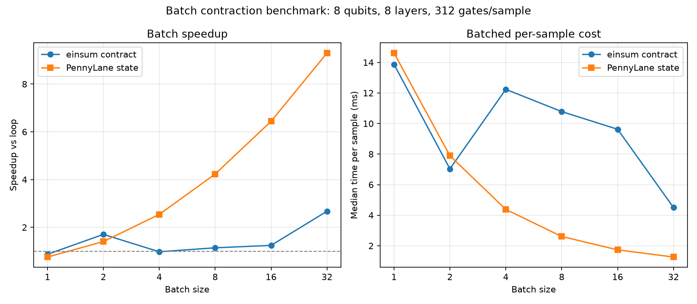

# Conversion Benchmarks

This benchmark measures PennyLane-to-einsum conversion time only. It does not
measure tensor contraction time.

The benchmark circuit uses larger synthetic layered circuits:

- `RX`, `RY`, and `RZ` on every qubit
- A ring of `CNOT` gates
- A nearest-neighbor chain of `CZ` gates

Each layer has `5 * n_qubits - 1` gates.

## Run

```bash
uv run --with matplotlib scripts/benchmark_pennylane_convert.py
```

Outputs:

- Raw CSV: `docs/benchmarks/pennylane_convert_large_circuits.csv`
- Plot: `docs/assets/pennylane_convert_large_circuits.png`

## Latest Local Result

Generated in this workspace on 2026-06-14.


| Qubits | Layers | Gates | Median conversion time |
|---:|---:|---:|---:|
| 4 | 5 | 95 | 1.738 ms |
| 6 | 8 | 232 | 4.237 ms |
| 8 | 12 | 468 | 8.175 ms |
| 10 | 16 | 784 | 14.391 ms |
| 12 | 20 | 1180 | 21.012 ms |
| 14 | 24 | 1656 | 29.656 ms |

On this run, conversion time scales roughly linearly with gate count and remains
under 30 ms at 1656 gates. This suggests conversion itself is
unlikely to be the bottleneck for QK-style experiments compared with repeated
contraction or model training work.

## Batch Contraction Benchmark

This benchmark checks whether contracting one batched einsum network is faster
than contracting each sample independently. Conversion is performed before the
timed region, so the `einsum contract` numbers measure `contract_einsum()` only.

It also includes PennyLane `default.qubit` statevector execution as a reference
point. The two timings are not the same operation:

- `einsum contract` measures opt_einsum contraction of already-built networks.
- `PennyLane state` measures PennyLane QNode execution returning `qml.state()`.

Run:

```bash
uv run --with matplotlib scripts/benchmark_batch_contraction.py
```

Outputs:

- Raw CSV: `docs/benchmarks/batch_contraction.csv`
- Plot: `docs/assets/batch_contraction_benchmark.png`

Latest local result uses 8 qubits, 8 layers, and 312 gates per sample.



| Batch | Einsum batched contract | Einsum loop contract | Einsum speedup | PennyLane batched state | PennyLane loop state | PennyLane speedup |
|---:|---:|---:|---:|---:|---:|---:|
| 1 | 13.875 ms | 12.110 ms | 0.87x | 14.614 ms | 11.081 ms | 0.76x |
| 2 | 14.065 ms | 24.005 ms | 1.71x | 15.789 ms | 22.190 ms | 1.41x |
| 4 | 48.956 ms | 47.895 ms | 0.98x | 17.513 ms | 44.545 ms | 2.54x |
| 8 | 86.252 ms | 98.777 ms | 1.15x | 20.861 ms | 88.329 ms | 4.23x |
| 16 | 154.000 ms | 191.760 ms | 1.25x | 27.726 ms | 178.606 ms | 6.44x |
| 32 | 144.044 ms | 385.424 ms | 2.68x | 40.420 ms | 375.832 ms | 9.30x |

For this circuit, batched contraction is not a clean B-times speedup. It becomes
faster than looped contraction for larger batches, but the extra batch dimension
changes tensor shapes and contraction paths. The B=32 case shows about 2.7x
faster contraction than contracting samples one by one.
