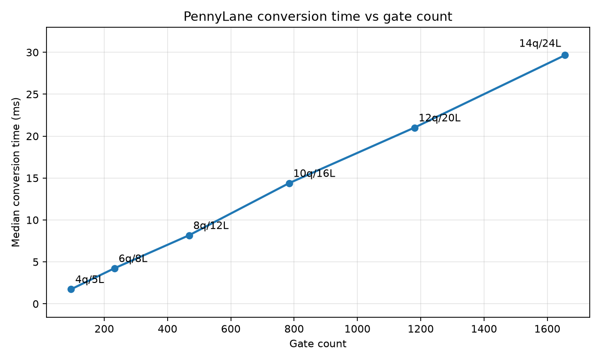

# Conversion Benchmarks

This benchmark measures PennyLane-to-einsum conversion time only. It does not
measure tensor contraction time.

The benchmark circuit uses larger synthetic layered circuits:

- `RX`, `RY`, and `RZ` on every qubit
- A ring of `CNOT` gates
- A nearest-neighbor chain of `CZ` gates

Each layer has `5 * n_qubits - 1` gates.

## Run

```bash
uv run --with matplotlib scripts/benchmark_pennylane_convert.py
```

Outputs:

- Raw CSV: `docs/benchmarks/pennylane_convert_large_circuits.csv`
- Plot: `docs/assets/pennylane_convert_large_circuits.png`

## Latest Local Result

Generated in this workspace on 2026-06-14.



| Qubits | Layers | Gates | Median conversion time |
|---:|---:|---:|---:|
| 4 | 5 | 95 | 1.738 ms |
| 6 | 8 | 232 | 4.237 ms |
| 8 | 12 | 468 | 8.175 ms |
| 10 | 16 | 784 | 14.391 ms |
| 12 | 20 | 1180 | 21.012 ms |
| 14 | 24 | 1656 | 29.656 ms |

On this run, conversion time scales roughly linearly with gate count and remains
under 30 ms at 1656 gates. This suggests conversion itself is
unlikely to be the bottleneck for QK-style experiments compared with repeated
contraction or model training work.
