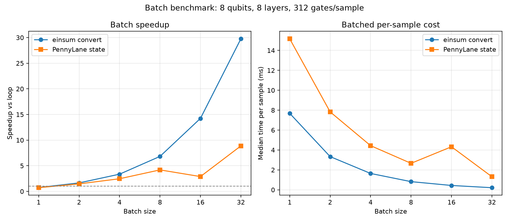

# Conversion Benchmarks

This benchmark measures PennyLane-to-einsum conversion time only. It does not
measure tensor contraction time.

The benchmark circuit uses larger synthetic layered circuits:

- `RX`, `RY`, and `RZ` on every qubit
- A ring of `CNOT` gates
- A nearest-neighbor chain of `CZ` gates

Each layer has `5 * n_qubits - 1` gates.

## Run

```bash
uv run --with matplotlib scripts/benchmark_pennylane_convert.py
```

Outputs:

- Raw CSV: `docs/benchmarks/pennylane_convert_large_circuits.csv`
- Plot: `docs/assets/pennylane_convert_large_circuits.png`

## Latest Local Result

Generated in this workspace on 2026-06-14.


| Qubits | Layers | Gates | Median conversion time |
|---:|---:|---:|---:|
| 4 | 5 | 95 | 1.738 ms |
| 6 | 8 | 232 | 4.237 ms |
| 8 | 12 | 468 | 8.175 ms |
| 10 | 16 | 784 | 14.391 ms |
| 12 | 20 | 1180 | 21.012 ms |
| 14 | 24 | 1656 | 29.656 ms |

On this run, conversion time scales roughly linearly with gate count and remains
under 30 ms at 1656 gates. This suggests conversion itself is
unlikely to be the bottleneck for QK-style experiments compared with repeated
contraction or model training work.

## Batch Conversion Benchmark

This benchmark checks whether one batched conversion is faster than converting
each sample independently. It also includes PennyLane `default.qubit`
statevector execution as a reference point. The two timings are not the same
operation:

- `einsum convert` measures `CircuitToEinsum.circuit_to_einsum` only.
- `PennyLane state` measures PennyLane QNode execution returning `qml.state()`.

Run:

```bash
uv run --with matplotlib scripts/benchmark_batch_conversion.py
```

Outputs:

- Raw CSV: `docs/benchmarks/batch_conversion.csv`
- Plot: `docs/assets/batch_conversion_benchmark.png`

Latest local result uses 8 qubits, 8 layers, and 312 gates per sample.



| Batch | Einsum batched convert | Einsum loop convert | Einsum speedup | PennyLane batched state | PennyLane loop state | PennyLane speedup |
|---:|---:|---:|---:|---:|---:|---:|
| 1 | 7.685 ms | 5.807 ms | 0.76x | 15.175 ms | 10.958 ms | 0.72x |
| 2 | 6.673 ms | 11.049 ms | 1.66x | 15.661 ms | 22.968 ms | 1.47x |
| 4 | 6.574 ms | 22.089 ms | 3.36x | 17.750 ms | 43.837 ms | 2.47x |
| 8 | 6.572 ms | 44.878 ms | 6.83x | 21.290 ms | 89.311 ms | 4.19x |
| 16 | 6.990 ms | 99.540 ms | 14.24x | 69.209 ms | 200.201 ms | 2.89x |
| 32 | 6.793 ms | 202.232 ms | 29.77x | 41.982 ms | 372.856 ms | 8.88x |

For this circuit, batched conversion stays around 6-7 ms while looped
conversion grows roughly linearly with batch size. The B=32 case shows about
30x faster conversion than converting samples one by one.
