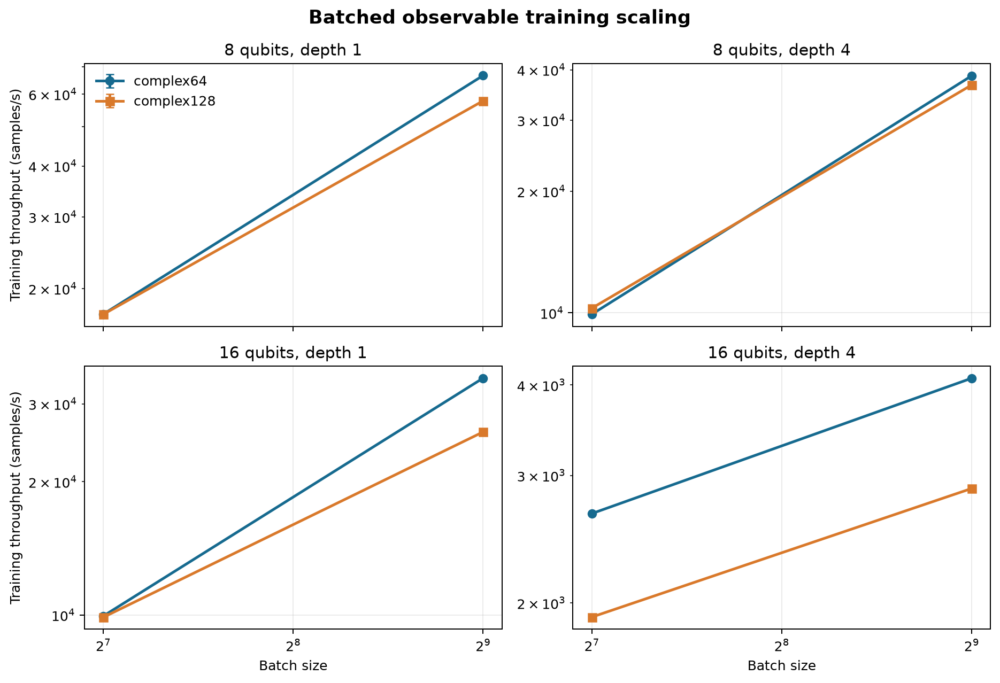
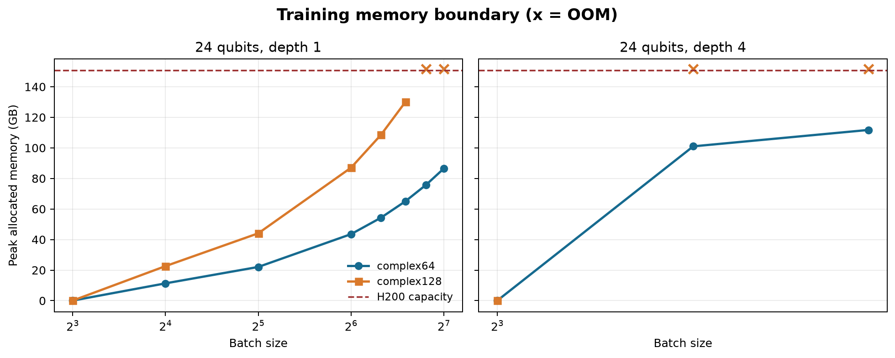
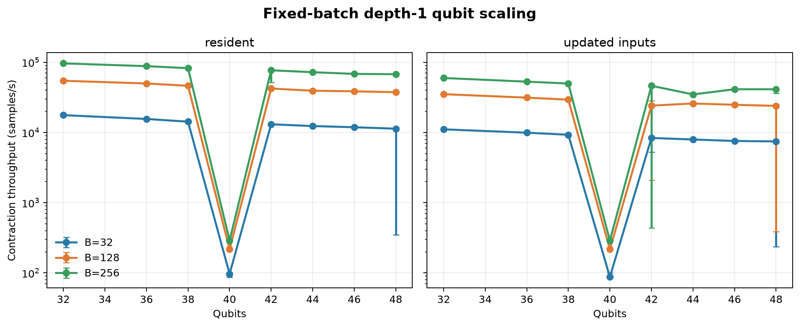
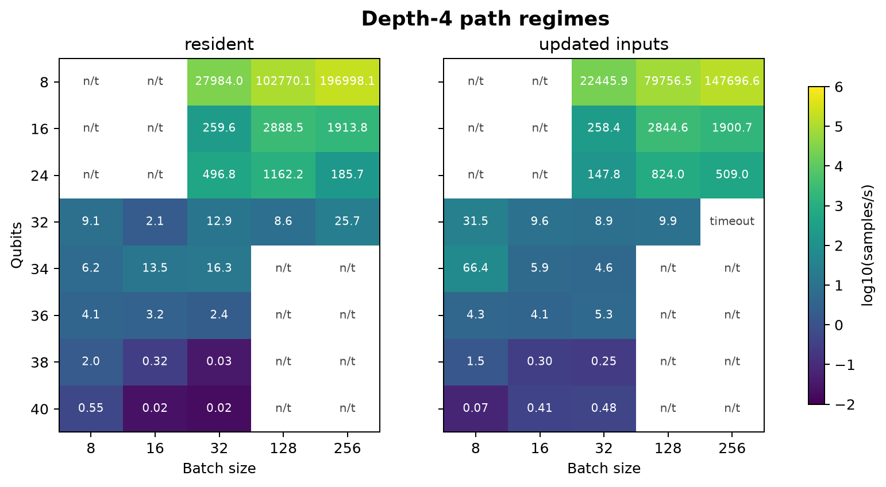
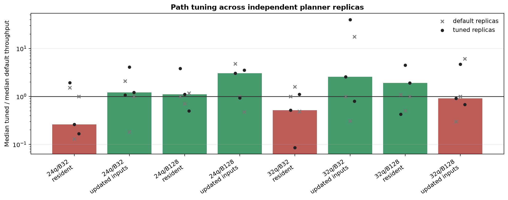

# Batched Observable Training and Fixed-Batch Scaling

日期：2026-08-03

## 摘要

本次實驗分成兩部分：

1. 測試 Torch einsum 實作在 batched observable training 下的可擴展範圍。
2. 測試固定 batch size 時，cuTensorNet contraction 在不同 qubit 數下的效能與穩定性。

實驗結果顯示，真正限制效能的因素不只是 qubit 數或 batch size，而是 contraction path 的選擇。部分組態只增加一個 batch，就會切換到需要大量 intermediate memory 的 path，造成吞吐量驟降甚至 OOM；相同 shape 在不同 planner run 中，也可能得到相差數十至上百倍的結果。

幾個重要結果如下：

- 16q、depth 4、batch 512 可穩定完成 100 個 training steps。`complex64` 為 4,086 samples/s，峰值記憶體 21.6 GB；`complex128` 為 2,876 samples/s，峰值 43.1 GB。
- 24q、depth 1 使用 `complex64` 時可執行到 batch 128，吞吐量約 294 samples/s，峰值 86.5 GB。`complex128` 最大成功值為 batch 96，batch 112 發生 OOM。
- 24q、depth 4 出現明顯的效能斷崖。`complex64` 從 B8 增加到 B9 後，吞吐量由 206 降至 3.79 samples/s，記憶體則從約 0.07 GB 跳至約 101 GB；B12 直接 OOM。
- Fixed-batch depth-1 可完成 48q/B256，但 40q 的所有重跑都落入低效 path；42q 和 48q 則可在不同 planner run 間出現數十至上百倍差距。
- 增加 optimizer samples 和 autotuning 並沒有帶來穩定改善。8 個測試組態中有 5 個中位數提高、3 個反而下降，而且兩組結果的範圍高度重疊。

## 實驗環境

| 項目             | 值                       |
| ---------------- | ------------------------ |
| GPU              | NVIDIA H200, 143,771 MiB |
| Driver           | 580.65.06                |
| CUDA module      | 12.6                     |
| Python           | 3.11.15                  |
| PennyLane        | 0.42.3                   |
| NumPy            | 2.4.4                    |
| opt_einsum       | 3.4.0                    |
| Torch            | 2.8.0                    |
| CuPy             | 14.1.1                   |
| cuQuantum Python | 26.6.0                   |
| cuTensorNet      | 2.13.0                   |

## 1. Observable Training

### 1.1 實驗設定

Circuit 使用 `pennylane_einsum.qae_circuit.qae_circuit`：每個 qubit 先套用 Hadamard 與三個 encoding rotation gates；每層再套用三個共享權重的 rotation gates，最後接上一條 linear CNOT chain。

批次輸入 shape 為 `(B, n_qubits, 3)`，VQC 權重 shape 為 `(layers, n_qubits, 3)`。同一個 batch 共用一組權重。

教師與學生皆使用單一 qubit 上的 Pauli-direction observable：

```text
H(theta, phi) = cos(theta) Z
              + sin(theta) cos(phi) X
              + sin(theta) sin(phi) Y
```

| 項目                   | 值                          |
| ---------------------- | --------------------------- |
| Teacher angles         | `(theta, phi) = (2.0, 1.0)` |
| Student initialization | `(0.1, 0.1)`                |
| Optimizer              | Adam                        |
| Learning rate          | 0.05                        |
| Loss                   | Batch mean squared error    |
| Measured steps         | 100                         |
| Warmup                 | 5 forward/backward passes   |
| Seeds                  | 2026, 2027, 2028            |

Circuit tensors 和 `opt_einsum.contract_expression` 都只建立一次。每個 training step 只重新建立可微分的 2×2 observable matrix。GPU 計時前後皆執行 `torch.cuda.synchronize()`。

正確性檢查方面，16q 以下使用 PennyLane `default.qubit` 作為參考；超過 16q 後，改用非批次 Torch direct-expectation contraction。`complex64` 的誤差約為 `1e-8` 至 `1.5e-6`，`complex128` 約為 `1e-16` 至 `1.8e-15`。

### 1.2 8q 與 16q

下表為三個 seed 的吞吐量中位數。

| Qubits | Depth | Batch | Dtype      | Samples/s | Peak allocated |
| -----: | ----: | ----: | ---------- | --------: | -------------: |
|      8 |     1 |   128 | complex64  |    17,309 |        0.15 GB |
|      8 |     1 |   512 | complex64  |    66,654 |        0.40 GB |
|      8 |     1 |   512 | complex128 |    57,769 |        0.74 GB |
|      8 |     4 |   512 | complex64  |    38,746 |        0.40 GB |
|      8 |     4 |   512 | complex128 |    36,695 |        0.74 GB |
|     16 |     1 |   128 | complex64  |     9,946 |        0.41 GB |
|     16 |     1 |   512 | complex64  |    34,298 |        1.41 GB |
|     16 |     1 |   512 | complex128 |    25,916 |        2.76 GB |
|     16 |     4 |   128 | complex64  |     2,657 |        5.45 GB |
|     16 |     4 |   128 | complex128 |     1,913 |       10.84 GB |
|     16 |     4 |   512 | complex64  |     4,086 |       21.56 GB |
|     16 |     4 |   512 | complex128 |     2,876 |       43.05 GB |

16q/depth4/B512 在三個 seed 中都能完成 100 個 steps，final loss 落在 `5.1e-7` 至 `6.1e-5`。這表示目前實作在 16q 下仍能支援較深 circuit 和大 batch，但 `complex128` 的記憶體使用量約為 `complex64` 的兩倍。



### 1.3 24q、depth 1

| Batch | complex64 samples/s | complex64 peak | complex128 samples/s | complex128 peak |
| ----: | ------------------: | -------------: | -------------------: | --------------: |
|     8 |             503–513 |        0.07 GB |              521–532 |         0.07 GB |
|    16 |                 212 |       11.34 GB |                  107 |        22.62 GB |
|    32 |             251–252 |       22.08 GB |                  139 |        44.09 GB |
|    64 |                 282 |       43.55 GB |                  163 |        87.04 GB |
|    80 |                 282 |       54.29 GB |                  160 |       108.52 GB |
|    96 |                 289 |       65.03 GB |                  169 |       129.99 GB |
|   112 |                 291 |       75.77 GB |                  OOM |             OOM |
|   128 |                 294 |       86.50 GB |                  OOM |             OOM |
|   512 |                 OOM |            OOM |                  OOM |             OOM |

B8 到 B16 之間出現第一次明顯的 path 切換：batch 增加後，記憶體不是平滑成長，而是直接跳到 11.34 GB（`complex64`）與 22.62 GB（`complex128`）。之後記憶體才大致隨 batch size 線性增加。

`complex64` 最後可執行到 B128；`complex128` 在 B96 時已使用約 130 GB，B112 即發生 OOM。

### 1.4 24q、depth 4

| Batch | complex64      | complex128    |
| ----: | -------------- | ------------- |
|     8 | 206 samples/s  | 214 samples/s |
|     9 | 3.79 samples/s | OOM           |
|    10 | 3.86 samples/s | OOM           |
|    12 | OOM            | OOM           |
|    14 | OOM            | OOM           |
|    16 | OOM            | OOM           |
|    32 | OOM            | OOM           |
|    64 | OOM            | OOM           |

這組結果呈現最明顯的 capacity cliff。B8 使用的 path 幾乎不需要大型 intermediate；增加到 B9 後，`complex64` 的 allocated memory 約為 101 GB，吞吐量同時下降約 54 倍。B10 勉強可執行，但 B12 已超過 H200 的可用記憶體。

這不是單純由 batch size 增加造成的線性成本，而是 contraction path 改變後，intermediate tensor 和 workspace 同時大幅增加。



### 1.5 收斂情況

所有成功組態的 loss 都有下降。多數結果在 100 個 steps 後低於 `1e-4`；少數 seed 與組態停在約 `1e-3` 至 `3e-3`。

因此，這批實驗足以確認訓練流程與梯度計算可正常運作，但 100 個 steps 並不能保證所有隨機資料都完全收斂。

## 2. Fixed-Batch Contraction

### 2.1 實驗設定

每個組態皆建立 direct `Z(0)` expectation network，完成 path planning 後執行 warmup 與重複計時。實驗比較兩種方式：

- **resident**：inputs 不變，所有 tensors 常駐 GPU。
- **updated-input**：每次從預先建立的 host tensors 更新 encoding gate buffers，再重用該 network 的 plan。

兩種方式使用相同 topology 和 tensor shapes，但分別建立 network、分別規劃 path。因此目前的數據不能直接視為「是否更新 input」的配對比較。若 updated-input 比 resident 快，只能表示該次規劃取得了更好的 path。

16q 以下以 PennyLane `default.qubit` 驗證，超過 16q 則使用 unbatched one-shot cuQuantum direct expectation。所有成功組態的最大絕對誤差皆低於 `3.1e-15`。

### 2.2 Depth-1 qubit scaling

40q 與 48q 各包含 7 個獨立 planner runs，42q 包含 6 個。表格中的多次結果以 median `[min–max]` 表示，其餘 qubit 數只有單次結果。

#### Resident throughput

| Qubits |                    B32 |                   B128 |                   B256 |
| -----: | ---------------------: | ---------------------: | ---------------------: |
|     32 |                 17,648 |                 54,524 |                 96,342 |
|     36 |                 15,571 |                 49,811 |                 87,952 |
|     38 |                 14,251 |                 46,224 |                 82,380 |
|     40 |            97 [87–101] |          218 [217–222] |          289 [288–297] |
|     42 | 13,073 [12,891–13,464] | 42,251 [41,762–43,782] | 76,794 [51,824–77,444] |
|     44 |                 12,340 |                 39,254 |                 72,169 |
|     46 |                 11,864 |                 38,546 |                 68,223 |
|     48 |    11,328 [350–11,699] | 37,443 [35,944–38,714] | 67,520 [65,873–69,899] |

#### Updated-input throughput

| Qubits |                 B32 |                  B128 |                   B256 |
| -----: | ------------------: | --------------------: | ---------------------: |
|     32 |              11,079 |                35,086 |                 59,621 |
|     36 |               9,928 |                31,328 |                 52,934 |
|     38 |               9,272 |                29,311 |                 49,740 |
|     40 |         88 [86–101] |         217 [217–222] |          288 [288–296] |
|     42 | 8,351 [5,231–8,744] | 24,118 [2,092–28,198] |    46,191 [437–46,809] |
|     44 |               7,941 |                25,854 |                 34,821 |
|     46 |               7,570 |                24,797 |                 41,246 |
|     48 |   7,454 [237–7,688] |   23,907 [388–24,424] | 41,228 [35,841–42,329] |

32q 到 38q 的吞吐量隨 qubit 數增加而逐步下降，趨勢相對平滑；40q 則突然跌到只有 86–297 samples/s，而且 7 次重跑全部重現，表示這不是偶發計時誤差，而是一個穩定的低效 path regime。

42q 大多恢復正常，但 updated-input 仍有明顯離群值。以 B256 為例，部分 planner run 約為 46,000 samples/s，另一些只有 437–466 samples/s，相差約 100 倍。48q/B32 resident 也出現 350–11,699 samples/s 的範圍。

這些差異主要發生在重新建立 network 並規劃 path 時；同一條 path 內的重複 execution 通常相當穩定。



### 2.3 Depth-4 scaling

| Qubits | Batch | Resident samples/s | Updated-input samples/s | 狀態                            |
| -----: | ----: | -----------------: | ----------------------: | ------------------------------- |
|     16 |    32 |                260 |                     258 | 完成                            |
|     16 |   128 |              2,888 |                   2,845 | 完成                            |
|     16 |   256 |              1,914 |                   1,901 | 完成                            |
|     24 |    32 |                497 |                     148 | 完成                            |
|     24 |   128 |              1,162 |                     824 | 完成                            |
|     24 |   256 |                186 |                     509 | 完成                            |
|     32 |    32 |               11.2 |                     5.9 | 完成                            |
|     32 |   128 |                8.6 |                     9.9 | 完成                            |
|     32 |   256 |               25.7 |                       — | updated-input path 超過 18 分鐘 |
|     36 |    32 |                2.5 |                     4.6 | 完成                            |
|     40 |    32 |              0.018 |                   0.476 | long-tail 測試完成              |

Depth 4 的效能下降比 depth 1 更早出現。32q 之後，大多數結果已低於每秒數十個 samples；40q/B32 resident 的中位 contraction time 更達 1,740.6 秒。

為了觀察這個長尾區域，另外測試 32q 至 40q、batch 8 至 32：

| Qubits | Batch | Resident samples/s | Updated-input samples/s |
| -----: | ----: | -----------------: | ----------------------: |
|     32 |     8 |               9.08 |                   31.52 |
|     32 |    16 |               2.07 |                    9.62 |
|     32 |    32 |              14.58 |                   11.98 |
|     34 |     8 |               6.17 |                   66.39 |
|     34 |    16 |              13.50 |                    5.93 |
|     34 |    32 |              16.29 |                    4.65 |
|     36 |     8 |               4.06 |                    4.26 |
|     36 |    16 |               3.17 |                    4.10 |
|     36 |    32 |               2.24 |                    5.98 |
|     38 |     8 |               1.99 |                    1.48 |
|     38 |    16 |              0.316 |                   0.296 |
|     38 |    32 |             0.0347 |                   0.251 |
|     40 |     8 |              0.547 |                  0.0683 |
|     40 |    16 |             0.0237 |                   0.407 |
|     40 |    32 |             0.0184 |                   0.476 |

40q/B32 的 resident 與 updated-input 分別規劃出約 `7.33e14` 和 `3.03e13` estimated FLOPs 的 path，相差約 24 倍；實際 latency 相差約 26 倍。這再次說明兩者的速度差主要來自 path，而不是 input update 本身。



圖中的 heatmap 對相同 `(method, qubits, batch)` 的成功結果取中位數，用來呈現不同 path regime 的數量級。由於部分組態的重跑次數與計時設定不同，精確數值仍以前述表格為準。

### 2.4 Optimizer sampling 與 autotuning

Default 與 tuned 各執行 3 個獨立 planner runs。Tuned 使用 100 個 pathfinder samples 和 3 次 autotune iterations。

| Qubits | Batch | Method        | Default samples/s |     Tuned samples/s | Ratio |
| -----: | ----: | ------------- | ----------------: | ------------------: | ----: |
|     24 |    32 | resident      | 2,043 [266–3,116] |     533 [343–3,975] | 0.26x |
|     24 |    32 | updated-input | 1,162 [213–2,426] | 1,407 [1,242–4,764] | 1.21x |
|     24 |   128 | resident      |     659 [468–772] |     726 [329–2,529] | 1.10x |
|     24 |   128 | updated-input |   510 [243–2,443] |   1,555 [479–1,807] | 3.05x |
|     32 |    32 | resident      |  14.7 [7.23–23.5] |    7.64 [1.26–16.4] | 0.52x |
|     32 |    32 | updated-input |   7.64 [2.37–135] |     19.6 [6.10–307] | 2.56x |
|     32 |   128 | resident      |  4.24 [2.15–4.65] |    8.13 [1.80–19.1] | 1.92x |
|     32 |   128 | updated-input |  10.1 [3.02–61.7] |    9.21 [6.85–47.2] | 0.92x |

8 個組態中有 5 個在 tuning 後提高中位數，另外 3 個下降。更重要的是，default 與 tuned 的結果範圍高度重疊，部分組態在重跑後甚至連改善或退化的方向都改變。

Tuning 因此不是固定倍率的加速手段，而是改變 planner 產生不同 path 的機率分布。Default planning 約需 12.3–47.1 秒；tuned planning 增加至 51.2–224.8 秒，另需 0.19–53.8 秒進行 autotuning。



## 3. 結果整理

這批實驗可以歸納出三個主要現象。

### 3.1 效能斷崖來自 path 切換

24q/depth4 的 B8→B9、24q/depth1 的 B8→B16，以及 fixed-batch 的 38q→40q，都不是平滑退化。它們同時伴隨吞吐量急降、intermediate memory 增加或 estimated FLOPs 上升，顯示 planner 切換到了完全不同的 contraction strategy。

### 3.2 Planner variance 大於 execution variance

當 path 已經固定後，重複 contraction 的時間通常很集中；真正的大幅波動發生在重新建立 network 和規劃 path 時。同一個 shape 的不同 planner runs，最極端可相差約 100 倍。

因此，單次 benchmark 很容易把偶然取得的好 path 或壞 path 當成系統的正常表現。這也是 40q、42q 和 48q 結果看起來不連續的主要原因。

### 3.3 Resident 與 updated-input 不能直接比較 update overhead

目前兩種方法分別規劃 path，並沒有共享同一個 contraction plan。某些組態中 updated-input 反而較快，並不代表資料更新沒有成本，只表示它碰巧取得了更有效率的 path。

## 實驗限制

- Training 只更新一個共享的 single-qubit observable，不更新 circuit gates。
- Training 使用 Torch/opt_einsum，fixed-batch contraction 使用 cuTensorNet，兩者的 path optimizer 不同，不能直接比較 latency。
- 超過 16q 後，正確性參考改為非批次 direct-expectation contraction，而不是完整 statevector。
- Fixed-batch 的記憶體數值來自 CuPy memory-pool snapshot，不代表整個 process 的完整峰值。
- 每個組態只有 3 至 7 個獨立 planner runs，可以看出長尾，但不足以精確估計低效 path 的發生機率。
- Fixed-batch 計時不包含新資料生成、gate matrix 建立與完整 input pipeline。
