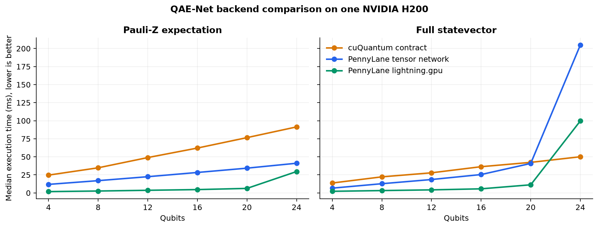
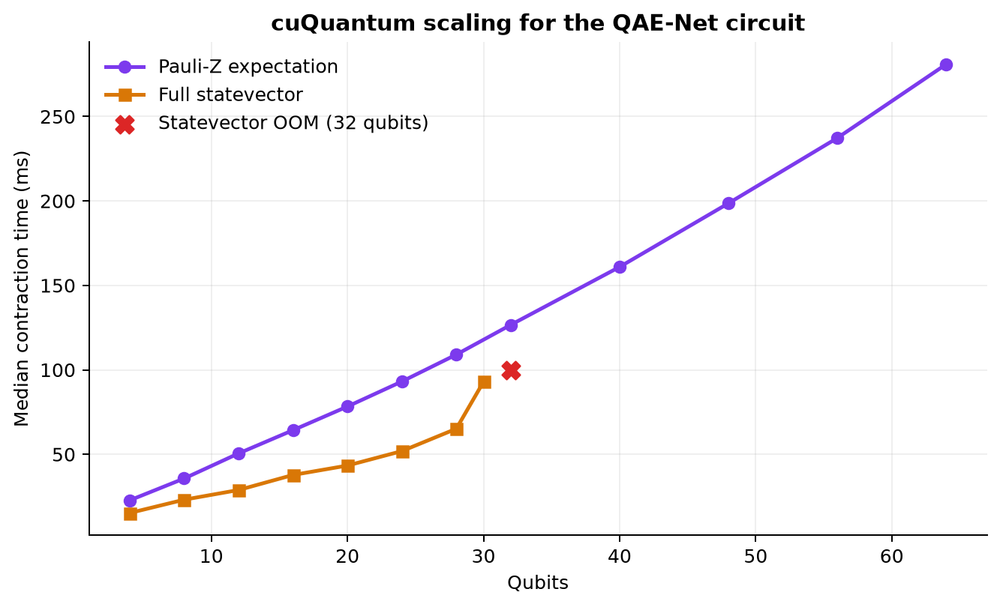
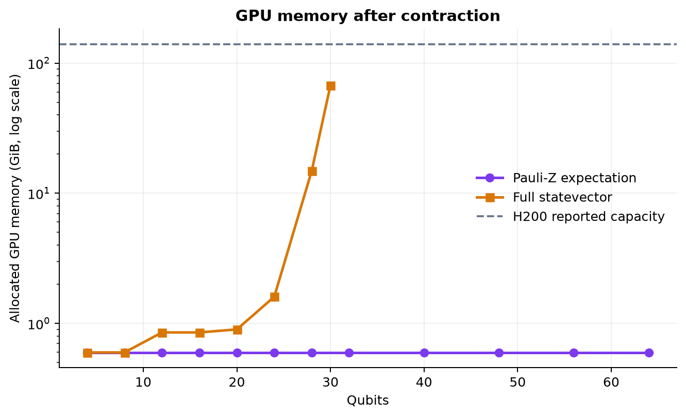

# QAE-Net cuQuantum 張量網路實驗報告

## 1. 實驗目的

本實驗評估 PennyLane-to-Einsum 產生的張量網路在 NVIDIA cuQuantum 上的
執行能力，主要回答兩個問題：

1. 對 QAE-Net 類型的 variational quantum circuit，直接計算 Pauli-Z
   expectation value 可以擴展到多少 qubits？
2. 本專案的 cuQuantum contraction 與 PennyLane tensor-network、GPU
   statevector backend 相比，執行時間與記憶體行為如何？

本報告只記錄電路、實驗方法與結果。叢集帳號、排程設定和節點操作資訊不在
本文件範圍內。

## 2. Benchmark 電路

### 2.1 電路來源與修改

電路參考 arXiv:2507.11217 Fig. 1。原始設計包含 Hadamard preparation、
`RZ-RY-RZ` angle encoding、trainable single-qubit rotations、CNOT
entanglement，以及 Pauli-Z expectation measurement。

為了讓 qubit 數可以持續增加，entanglement 採用 linear chain：

```text
CNOT(0, 1), CNOT(1, 2), ..., CNOT(n-2, n-1)
```

不加入首尾相連的：

```text
CNOT(n-1, 0)
```

### 2.2 電路定義

對 `n` 個 qubits：

1. 每個 qubit 套用 Hadamard gate。
2. 每個 qubit 使用三個 inputs 做 `RZ-RY-RZ` encoding。
3. 每個 VQC layer 對每個 qubit套用 trainable `RZ-RY-RZ`。
4. 每個 VQC layer 套用 linear CNOT chain。
5. 輸出完整 statevector，或直接 contraction `PauliZ(0)` expectation。

```text
q0: |0>--H--RZ(x0)--RY(x1)--RZ(x2)--RZ(t0)--RY(t1)--RZ(t2)--*--------------
                                                                  |
q1: |0>--H--RZ(x3)--RY(x4)--RZ(x5)--RZ(t3)--RY(t4)--RZ(t5)--X--*-----------
                                                                     |
q2: |0>--H--RZ(x6)--RY(x7)--RZ(x8)--RZ(t6)--RY(t7)--RZ(t8)-----X--*--------
                                                                        |
...                                                                    ...
                                                                        |
qn: |0>--H--RZ(...)--RY(...)--RZ(...)--RZ(...)--RY(...)--RZ(...)-------X--
```

若 VQC depth 為 `L`，gate 數量為：

```text
Hadamard:             n
encoding rotations:  3n
VQC local rotations: 3nL
CNOT:                 (n - 1)L
total:                4n + (4n - 1)L
```

本實驗固定 `L = 1`，因此總 gate 數為 `8n - 1`。

### 2.3 參數

- Random seed：`2026`
- Inputs shape：`(n_qubits, 3)`
- Weights shape：`(layers, n_qubits, 3)`
- Parameter range：`[-pi, pi]`
- 所有 backend 使用相同 deterministic parameters。

## 3. 實驗方法

### 3.1 Backend

| 名稱 | 實作 | 執行方式 |
|---|---|---|
| cuQuantum | 本專案 einsum network + `cuquantum.tensornet.contract` | GPU tensor contraction |
| PennyLane tensor | `default.tensor(method="tn")` | CPU tensor-network backend |
| PennyLane statevector | `lightning.gpu` | GPU statevector simulation |

測試 GPU 為一張 NVIDIA H200，reported memory 約 139.8 GiB。軟體版本為
Python 3.11、CUDA 12.6、cuQuantum 26.6.0、CuPy 14.1.1 與 PennyLane
0.42.3。

PennyLane `default.tensor` 使用 CPU，因此 backend comparison 是同一實驗環境
中的 library-level wall-clock comparison，不是三者使用完全相同硬體路徑的
GPU microbenchmark。

### 3.2 Tensor-network 輸出

Statevector 路徑保留所有 final qubit indices，輸出大小為 `2**n`。

Expectation 路徑直接建立：

```text
<0...0| U^dagger O U |0...0>
```

最終輸出為 scalar，不會先 materialize 完整 statevector。預設初態
`|0...0>` 以每個 qubit 一個 shape `(2,)` 的 product tensor 表示，也不會在
contraction 前建立長度 `2**n` 的初態 array。

### 3.3 計時

- 每個 case 先執行一次 warm-up。
- 正式執行 3 次，報告 median wall time。
- GPU 計時前後執行 CUDA stream synchronization。
- cuQuantum 的 circuit conversion 與 contraction 分開計時。
- 本報告主要 runtime 不包含本專案的 conversion time。
- 每個 case 後執行 garbage collection 並釋放 CuPy memory-pool blocks。

PennyLane QNode execution 內含其裝置 preprocessing，不能與本專案 conversion
階段完全一一對齊。因此結果應解讀為實際 backend execution comparison。

### 3.4 掃描範圍

Expectation scaling：

```text
4, 8, 12, 16, 20, 24, 28, 32, 40, 48, 56, 64 qubits
```

Statevector scaling：

```text
4, 8, 12, 16, 20, 24, 28, 30, 32 qubits
```

Backend comparison：

```text
4, 8, 12, 16, 20, 24 qubits
```

### 3.5 正確性

- Unit tests 將完整 statevector 與 PennyLane `qml.state()` 比較。
- Unit tests 比較每個 qubit 的 Pauli-Z expectation。
- Runtime benchmark 比較 `PauliZ(0)` 或 statevector 第一個 amplitude。
- 三個 backend 在所有 comparison cases 都得到一致數值。
- 完整測試結果為 `40 passed, 3 skipped`。

## 4. Backend Comparison



### 4.1 Pauli-Z expectation

| Qubits | cuQuantum | PennyLane tensor | PennyLane `lightning.gpu` |
|---:|---:|---:|---:|
| 4 | 24.66 ms | 11.82 ms | 1.83 ms |
| 8 | 34.77 ms | 16.99 ms | 2.63 ms |
| 12 | 48.95 ms | 22.46 ms | 3.63 ms |
| 16 | 62.12 ms | 28.32 ms | 4.62 ms |
| 20 | 76.57 ms | 34.29 ms | 6.25 ms |
| 24 | 91.42 ms | 41.10 ms | 29.60 ms |

在 24 qubits 時：

- PennyLane tensor 約為 cuQuantum 的 `2.22x` 速度。
- `lightning.gpu` 約為 cuQuantum 的 `3.09x` 速度。

本電路 depth 低、entanglement 為 linear chain，且 observable 只有 local
`Z0`。在這類低 treewidth scalar contraction 中，cuQuantum 的通用 network
planning 與 contraction overhead 尚未由較大的算術工作量攤平。

### 4.2 Full statevector

| Qubits | cuQuantum | PennyLane tensor | PennyLane `lightning.gpu` |
|---:|---:|---:|---:|
| 4 | 13.72 ms | 6.62 ms | 2.24 ms |
| 8 | 22.27 ms | 12.76 ms | 3.24 ms |
| 12 | 27.85 ms | 18.55 ms | 4.23 ms |
| 16 | 36.32 ms | 25.45 ms | 5.67 ms |
| 20 | 42.30 ms | 40.82 ms | 11.25 ms |
| 24 | 50.10 ms | 204.85 ms | 99.71 ms |

小規模時 `lightning.gpu` 最快。到 24 qubits 時發生 crossover：

- cuQuantum 比 PennyLane tensor 快約 `4.09x`。
- cuQuantum 比 `lightning.gpu` 快約 `1.99x`。

完整輸出增加後，cuQuantum 在本電路上的 contraction 路徑開始優於兩個
PennyLane 執行路徑。不過本次每點只有 3 次，仍需要更多 repetitions 與
獨立 runs 才能估計 variance。

## 5. cuQuantum Scaling



### 5.1 Pauli-Z expectation

| Qubits | Conversion | Median contraction | Status |
|---:|---:|---:|---|
| 4 | 2.47 ms | 22.77 ms | Success |
| 16 | 5.38 ms | 64.29 ms | Success |
| 32 | 10.42 ms | 126.64 ms | Success |
| 48 | 15.17 ms | 198.63 ms | Success |
| 64 | 20.23 ms | 280.94 ms | Success |

64-qubit expectation 仍成功，runtime 隨 qubit 數平順上升，未出現
statevector 型態的 exponential memory growth。主要原因是：

- 電路只有一個 VQC layer。
- entanglement 是低 treewidth linear chain。
- contraction 只輸出一個 scalar。
- product-state 初態不需要 `2**n` allocation。

本次結果只能得出：

> 對此 depth-1 linear-chain QAE-Net 電路，一張 H200 至少可以執行
> 64-qubit Pauli-Z expectation contraction。

64 是本次掃描上限，不是已找到的最大 qubit 數。

### 5.2 Full statevector

| Qubits | Median contraction | GPU allocation snapshot | Status |
|---:|---:|---:|---|
| 24 | 51.91 ms | 1.60 GiB | Success |
| 28 | 65.14 ms | 14.86 GiB | Success |
| 30 | 92.96 ms | 67.37 GiB | Success |
| 32 | N/A | N/A | GPU OOM |

32-qubit contraction 錯誤：

```text
Out of memory allocating 70,871,155,200 bytes
(allocated so far: 139,590,778,880 bytes)
```

product-state 初態只移除不必要的 input allocation。完整 statevector 仍有
`2**n` amplitudes，並且需要額外 contraction workspace，因此無法消除其
exponential memory 下限。

## 6. GPU Memory



Expectation contraction 完成後的 GPU allocation snapshot 在所有掃描點約為
0.60 GiB。Statevector 在 24 qubits 後快速增加，30 qubits 約為
67.37 GiB。

這些數值來自 contraction 完成後的 `memGetInfo()`，不是執行期間的 peak
memory。cuQuantum 可能在 contraction 中配置並釋放 workspace，因此圖表適合
顯示趨勢，不應視為精確峰值。32-qubit OOM 訊息顯示實際執行期間已配置約
139.6 GB，再要求約 70.9 GB，超過單張 H200 容量。

## 7. 結論

1. cuQuantum contraction 可正確執行 QAE-Net statevector 與 direct
   expectation tensor networks。
2. Direct expectation 避免 `2**n` output，使本次電路至少擴展到
   64 qubits。
3. Full statevector 成功至 30 qubits，32 qubits 因 GPU memory 不足失敗。
4. 小規模 statevector simulation 由 `lightning.gpu` 領先；24 qubits 時
   cuQuantum 反而最快。
5. 對本次 local expectation，PennyLane tensor backend 與
   `lightning.gpu` 都比通用 cuQuantum contraction 快。
6. 電路深度、treewidth 與輸出型態比 qubit 數本身更能決定 tensor-network
   contraction 的實際難度。

## 8. 實驗限制

- 只測試 `L = 1`。
- Scalar benchmark 只測量 `PauliZ(0)`。
- Expectation 只掃描到 64 qubits，尚未找到真正上限。
- 每個 case 只有 3 次 repetitions，且只有一組正式數據。
- Memory 數字不是 peak memory。
- PennyLane tensor backend 使用 CPU，不是 GPU 對 GPU 的完全公平比較。
- 尚未分離 cuQuantum path planning 與 execution time。
- 沒有重用 contraction plan。
- 沒有測試 gradients、parameter-shift、batch training 或多 GPU。

## 9. 後續實驗

1. 將 expectation scan 擴展到 128、256、512 qubits。
2. 增加 `L = 2, 3, 4, 8`，繪製 qubit-depth scaling heatmap。
3. 分離 path planning 與 execution，測試 plan reuse 的 repeated inference。
4. 比較 `lightcone=False` 與 `lightcone=True`。
5. 使用 profiler 或 CUDA events 量測 peak memory 與 kernel time。
6. 每點至少執行 10 次，並使用多組獨立 runs 報告 variance。
7. 增加 batch contraction 與完整 QML inference/training workload。

## 10. 數據與繪圖

原始 CSV：

- `docs/benchmarks/qae_backend_comparison_177851.csv`
- `docs/benchmarks/qae_cuquantum_expval_scaling_177851.csv`
- `docs/benchmarks/qae_cuquantum_state_scaling_177851.csv`

重新產生圖表：

```bash
uv run --python 3.11 --with matplotlib scripts/plot_qae_benchmarks.py \
  --job-id 177851
```

輸出圖檔：

- `docs/assets/qae_backend_comparison.png`
- `docs/assets/qae_cuquantum_scaling.png`
- `docs/assets/qae_gpu_memory.png`
