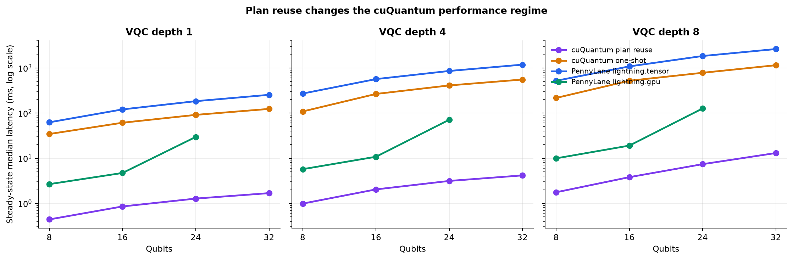
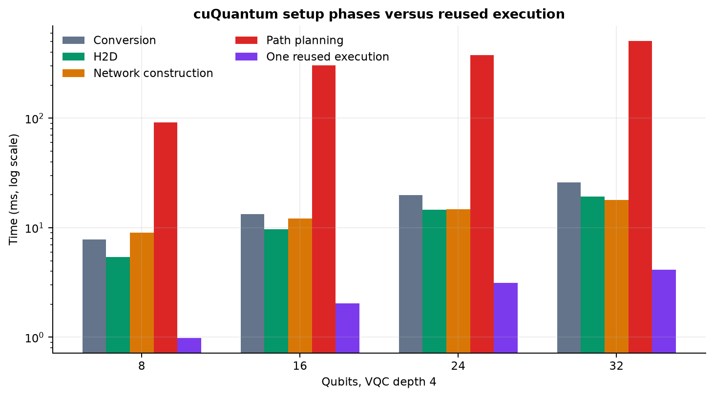
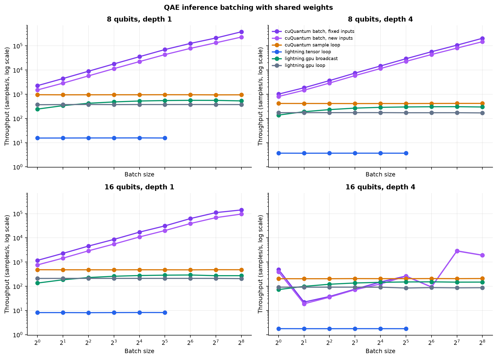

# cuTensorNet Plan Reuse 與 QAE Batching 實驗報告

## 1. 實驗問題

前一輪 benchmark 使用 `cuquantum.tensornet.contract()` one-shot API。每次
呼叫都包含 NumPy-to-CuPy conversion、network construction 與 path planning，
因此無法回答固定 circuit topology 重複執行時的 steady-state 效能。

本輪重新設計實驗以回答：

1. 將 H2D、network construction、path planning 與 execution 分開後，真正的
   cuTensorNet contraction latency 是多少？
2. 重用 `cuquantum.tensornet.Network` 的 contraction path 與 workspace，能否
   超過 PennyLane 原生 `lightning.tensor` 與 `lightning.gpu`？
3. 對 QAE inference 的 batched inputs、shared weights，true batched network
   能否勝過逐 sample loop 與 PennyLane parameter broadcasting？
4. 當每次 inference 使用新 inputs 時，更新 GPU tensors 的成本是否會抵銷
   batching 優勢？

本報告不包含排程帳號、節點名稱或叢集操作資訊。

## 2. 實作

### 2.1 Reusable cuQuantum contractor

新增 `CuQuantumContractor`，生命週期為：

```text
NumPy tensors
  -> H2D
  -> Network construction
  -> contract_path()
  -> optional autotune()
  -> warm-up contract()
  -> repeated contract()
  -> reset_operands() / in-place buffer update
  -> free()
```

固定 topology 下，`contract_path()` 只執行一次。之後可以：

- 對相同 GPU operands 重複 contraction。
- 使用相同 shape、stride、dtype 的新 operands 呼叫 `reset_operands()`。
- 保留 path 與 workspace，避免每次重建 network。

### 2.2 分段計時

cuQuantum 記錄：

- `conversion_seconds`
- `h2d_seconds`
- `network_construction_seconds`
- `path_planning_seconds`
- `autotune_seconds`
- `median_seconds`：plan-reused execution

GPU 計時前後執行 stream synchronization。每個 steady-state case 使用：

- 10 次 warm-ups
- 30 次 measurements
- median、min、p25、p75、max

### 2.3 PennyLane GPU backends

比較方法：

- `lightning.tensor(method="tn", backend="cutensornet")`
- `lightning.gpu`

兩個 Lightning plugins 在 0.42 版不能安全地載入同一 Python process，會產生
binary symbol registration conflict，因此正式 benchmark 將每個 plugin 放在
獨立 process。

### 2.4 QAE batching workload

使用 realistic inference semantics：

```text
inputs:  (B, n_qubits, 3)       # 每個 sample 不同
weights: (layers, n_qubits, 3)  # 所有 samples 共用
output:  (B,) PauliZ(0) expectations
```

比較三種 cuQuantum scenarios：

1. `cuquantum-batch-reuse`：inputs 固定、GPU-resident、execution only。
2. `cuquantum-batch-update`：每次使用新 inputs，只更新變動的 encoding
   tensors，再 contraction；shared weights 保持 resident。
3. `cuquantum-loop-reuse`：每個 sample 獨立 contraction，但重用同一個
   unbatched path。

PennyLane baselines：

- `lightning.gpu` native parameter broadcasting。
- `lightning.gpu` sample loop。
- `lightning.tensor` sample loop。

Lightning Tensor 0.42 的 exact TN backend 不支援 parameter broadcasting；將
shape `(B,)` 的 rotation parameter 傳入其 C++ gate API 會失敗。因此它沒有
native batch 曲線，只能用逐 sample loop 作為原生 baseline。

## 3. Plan Reuse 結果



### 3.1 代表性結果

| Qubits | Depth | cuQuantum reuse | cuQuantum one-shot | lightning.gpu | lightning.tensor |
|---:|---:|---:|---:|---:|---:|
| 8 | 1 | 0.439 ms | 34.32 ms | 2.66 ms | 62.32 ms |
| 16 | 4 | 2.030 ms | 265.04 ms | 10.74 ms | 565.63 ms |
| 24 | 8 | 7.361 ms | 781.03 ms | 126.35 ms | 1838.06 ms |
| 32 | 8 | 12.989 ms | 1148.90 ms | N/A | 2621.56 ms |

### 3.2 Speedup

16 qubits、depth 4：

- 對 cuQuantum one-shot：`130.6x`
- 對 `lightning.gpu`：`5.29x`
- 對 `lightning.tensor`：`278.7x`

24 qubits、depth 8：

- 對 cuQuantum one-shot：`106.1x`
- 對 `lightning.gpu`：`17.16x`
- 對 `lightning.tensor`：`249.7x`

32 qubits、depth 8：

- 對 cuQuantum one-shot：`88.45x`
- 對 `lightning.tensor`：`201.83x`

所有正式測試點中：

- 對 one-shot speedup 約 `71.7x` 到 `137.2x`。
- 對 `lightning.gpu` speedup 約 `5.0x` 到 `23.3x`。
- 對 `lightning.tensor` speedup 約 `141.7x` 到 `296.4x`。

因此我們的方法可以打敗 PennyLane 原生 GPU backends，但條件是 topology
重複使用、path planning 與 workspace 能被攤提。不能把 execution-only
speedup 解讀成 cold-start speedup。

## 4. Setup 與 Break-even



### 4.1 Setup 主成本

對 depth 4，path planning 明顯大於單次 reused execution：

| Qubits | Conversion | H2D | Construction | Planning | Reused execution |
|---:|---:|---:|---:|---:|---:|
| 8 | 7.78 ms | 5.42 ms | 9.04 ms | 91.11 ms | 0.984 ms |
| 16 | 13.30 ms | 9.72 ms | 12.10 ms | 304.94 ms | 2.030 ms |
| 24 | 19.78 ms | 14.57 ms | 14.82 ms | 376.39 ms | 3.128 ms |
| 32 | 26.05 ms | 19.26 ms | 17.98 ms | 509.83 ms | 4.148 ms |

### 4.2 Break-even

定義 setup：

```text
conversion + H2D + network construction + path planning
```

16 qubits、depth 4 的 setup 約 340.05 ms：

- 對 one-shot 約第 2 次 execution 即回本。
- 對 `lightning.tensor` 第 1 次即回本，因其單次 QNode execution 已較慢。
- 對 `lightning.gpu` 約需要 40 次 execution 才回本。

24 qubits、depth 1：

- 對 one-shot 約 2 次。
- 對 `lightning.tensor` 約 1 次。
- 對 `lightning.gpu` 約 4 次。

8 qubits、depth 1 第一個 case 包含 CUDA/cuTensorNet lazy initialization，
network construction 為 1.776 s，屬於 process cold-start anomaly。這個 case
對 `lightning.gpu` 需約 817 次才回本，顯示部署服務應先初始化 context 與
network，不能把第一個 process call 當 steady-state。

## 5. Batching 結果



### 5.1 固定 inputs 的上限吞吐量

| Qubits | Depth | B | cuQuantum batch | cuQuantum loop | Speedup |
|---:|---:|---:|---:|---:|---:|
| 8 | 1 | 256 | 379,723 samples/s | 944 samples/s | `402.2x` |
| 8 | 4 | 256 | 204,645 samples/s | 418 samples/s | `489.5x` |
| 16 | 1 | 256 | 141,816 samples/s | 480 samples/s | `295.5x` |
| 16 | 4 | 256 | 1,916 samples/s | 208 samples/s | `9.21x` |

固定 inputs 是 best-case replay，適合展示 GPU-resident execution 上限，但不是
一般 inference 的唯一指標。

### 5.2 新 inputs、shared weights

每次更新 encoding tensors，保留 shared weights、path 與 workspace：

| Qubits | Depth | B | cuQuantum update | cuQuantum loop | Speedup |
|---:|---:|---:|---:|---:|---:|
| 8 | 1 | 256 | 229,899 samples/s | 944 samples/s | `243.5x` |
| 8 | 4 | 256 | 148,299 samples/s | 418 samples/s | `354.7x` |
| 16 | 1 | 256 | 95,627 samples/s | 480 samples/s | `199.2x` |
| 16 | 4 | 256 | 1,897 samples/s | 208 samples/s | `9.12x` |

這是比固定 replay 更接近 QAE inference 的結果。即使包含新 input tensor 的
H2D update，8-qubit 與 16-qubit depth-1 workload 仍有顯著 batching 優勢。

### 5.3 對 PennyLane batching

代表性 B=256：

| Qubits | Depth | cuQuantum new inputs | lightning.gpu broadcast | Ratio |
|---:|---:|---:|---:|---:|
| 8 | 1 | 229,899 samples/s | 530 samples/s | `434x` |
| 8 | 4 | 148,299 samples/s | 297 samples/s | `499x` |
| 16 | 1 | 95,627 samples/s | 273 samples/s | `350x` |
| 16 | 4 | 1,897 samples/s | 148 samples/s | `12.8x` |

Lightning Tensor 不支援 native batch。其 loop throughput 約為：

- 8 qubits、depth 1：15.6 samples/s
- 8 qubits、depth 4：3.66 samples/s
- 16 qubits、depth 1：8.20 samples/s
- 16 qubits、depth 4：1.76 samples/s

因此 true batched cuTensorNet network 是目前最能展現本專案優勢的實驗。

## 6. Non-monotonic Path 現象

16 qubits、depth 4 的 batching 不是單調 scaling：

| B | Fixed throughput | New-input throughput |
|---:|---:|---:|
| 1 | 490 samples/s | 394 samples/s |
| 2 | 22 samples/s | 19 samples/s |
| 32 | 264 samples/s | 258 samples/s |
| 64 | 93 samples/s | 92 samples/s |
| 128 | 2,896 samples/s | 2,844 samples/s |
| 256 | 1,916 samples/s | 1,897 samples/s |

這不是正常的 GPU saturation 曲線，而是 contraction optimizer 在不同 batch
dimension 下選到不同 path、layout 或 workspace regime。B=2 甚至比 unbatched
loop 慢；B=128 則突然大幅加速。

這個結果顯示 batch size 不能只用 powers-of-two 後假設單調增加。正式部署應：

1. 對每個 topology 與 batch size分別規劃 path。
2. 保存 path benchmark cache。
3. 在目標 GPU 上搜尋 throughput 最佳的 batch size。
4. 同時考慮 latency SLA，不只最大 samples/s。

此異常另以獨立 job 重跑，default optimizer 再次得到相同 regime：B=2 約
20 samples/s、B=64 約 92 samples/s、B=128 約 2928 samples/s，確認不是單次
量測雜訊。將 pathfinder samples 提高到 100 仍未穩定消除異常，表示只增加
隨機搜尋樣本不足以保證找到適合 batch dimension 的 path；後續需要保存與
比較實際 path、workspace 和 slicing 設定。

## 7. Key Insights

### 7.1 原先 cuQuantum 較慢是 API 使用方式問題

one-shot `contract()` 把 setup 與 execution 混在每次呼叫中。分離後可以看到
真正 contraction 通常只有 0.4 到 13 ms，而 one-shot 是 34 ms 到 1.15 s。

### 7.2 我們的主要優勢是 repeated topology

QML inference、parameter-shift、dataset batching 與訓練 forward passes 都會
重複相同 circuit topology。這正是 reusable cuTensorNet network 最有利的
情境。

### 7.3 Lightning Tensor 不是 native batching baseline

其 exact TN backend 目前無法接收 broadcast gate parameters。PennyLane 使用者
只能逐 sample 執行，導致 Python/QNode/network setup 線性重複。

### 7.4 Batching 的優勢不等於任何 batch 都更快

8-qubit cases 幾乎隨 B 穩定增長；16-qubit depth-4 則受 path regime 影響，
B=2 和 B=64 表現不佳。Optimizer/path tuning 是產品化前的必要工作。

### 7.5 Cold-start 與 steady-state 必須分開報告

對單次 ad-hoc circuit，`lightning.gpu` 可能仍是較好選擇；對數十次以上的固定
topology，plan reuse 才開始展現完整優勢。

## 8. 限制

- QAE circuit 仍只有 linear CNOT chain。
- Steady-state comparison 固定 circuit parameters；new-input cost 在 batching
  實驗另行測量。
- cuQuantum update benchmark 預先在 CPU materialize 多組 gate tensors，計時
  包含 changed-tensor H2D 與 contraction，不包含重新計算 gate matrices。
- Batching methods 的 repeats 不完全相同：cuQuantum 30、Lightning GPU 20、
  Lightning Tensor loop 5。
- Path planning time 每個 case 只量一次，沒有 variance。
- 尚未啟用 cuTensorNet autotune。
- 尚未量測 peak GPU memory、workspace bytes 與 power。
- 16-qubit depth-4 path anomaly 需要更多獨立 runs 與 optimizer settings 驗證。

## 9. 重現資料

Steady-state CSV：

- `docs/benchmarks/qae_reuse_cuquantum_177982.csv`
- `docs/benchmarks/qae_reuse_lightning_tensor_177982.csv`
- `docs/benchmarks/qae_reuse_lightning_gpu_177982.csv`

Batching CSV：

- `docs/benchmarks/qae_batch_cuquantum_batch_reuse_177982.csv`
- `docs/benchmarks/qae_batch_cuquantum_batch_update_177982.csv`
- `docs/benchmarks/qae_batch_cuquantum_loop_reuse_177982.csv`
- `docs/benchmarks/qae_batch_lightning_tensor_loop_177982.csv`
- `docs/benchmarks/qae_batch_lightning_gpu_batch_177982.csv`
- `docs/benchmarks/qae_batch_lightning_gpu_loop_177982.csv`

Path anomaly rerun：

- `docs/benchmarks/qae_batch_path_samples0_178145.csv`
- `docs/benchmarks/qae_batch_path_samples100_178145.csv`

繪圖：

```bash
uv run --python 3.11 --with matplotlib scripts/plot_qae_reuse_batching.py \
  --job-id 177982
```
